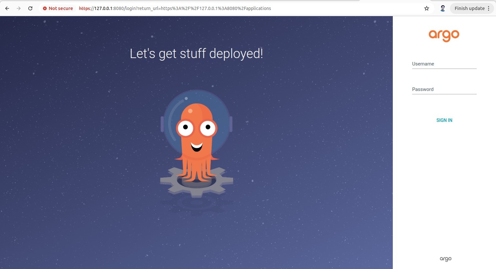

# Installing Argo CD in Kubernetes

This guide provides step-by-step instructions to install Argo CD in a Kubernetes cluster.

## Prerequisites

- Kubernetes cluster
- `kubectl` command-line tool configured to interact with your cluster

## Step 1: Install ArgoCD

### 1.1 Create Namespace

Create a new namespace where ArgoCD services and application resources will live:

```sh
kubectl create namespace argocd
```

### 1.2 Apply Installation Manifests

Apply the Argo CD installation manifests:

```sh
kubectl apply -n argocd -f https://raw.githubusercontent.com/argoproj/argo-cd/stable/manifests/install.yaml
```

## Step 2: Access The ArgoCD using Port Forwarding

Use `kubectl` port-forwarding to connect to the API server without exposing the service:

```sh
kubectl port-forward svc/argocd-server -n argocd 8080:443
```

The API server can then be accessed using `https://localhost:8080`.

