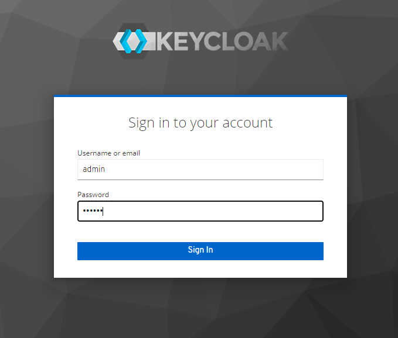

### Keycloak Installation on Minikube Cluster

This guide provides step-by-step instructions for installing Keycloak on a Minikube cluster. Keycloak is an open-source Identity and Access Management (IAM) solution that can be easily integrated into Kubernetes environments.

## Prerequisites

1. Minikube installed

2. kubectl installed

## Steps

1. Start Minikube
Ensure that Minikube is running with the required resources. Run the following command to start Minikube

2. To check if you have the Ingress addon enabled, enter the following command:

```
minikube addons list
```
3. If the Ingress addon is not enabled, enter the following command to enable it:

```
minikube addons enable ingress
```
4. Start Keycloak

The Keycloak QuickStarts repository includes some example files to help deploy Keycloak to Kubernetes.

As a first step, create the Keycloak deployment and service by entering the following command:
```
kubectl create -f https://raw.githubusercontent.com/keycloak/keycloak-quickstarts/latest/kubernetes/keycloak.yaml
```
This command starts Keycloak on Kubernetes and creates an initial admin user with the username admin and password admin.

5. Access Keycloak with Ingress addon enabled

Now create an Ingress for Keycloak by entering the following command:

```wget -q -O - https://raw.githubusercontent.com/keycloak/keycloak-quickstarts/latest/kubernetes/keycloak-ingress.yaml | \
sed "s/KEYCLOAK_HOST/keycloak.$(minikube ip).nip.io/" | \
kubectl create -f -
```

If wget and sed are not available, download the file and manually edit the file replacing KEYCLOAK_HOST with keycloak.<minikube ip address>.nip.io.

6. Enter the following command to see the Keycloak URLs:

```
KEYCLOAK_URL=https://keycloak.$(minikube ip).nip.io &&
echo "" &&
echo "Keycloak:                 $KEYCLOAK_URL" &&
echo "Keycloak Admin Console:   $KEYCLOAK_URL/admin" &&
echo "Keycloak Account Console: $KEYCLOAK_URL/realms/myrealm/account" &&
echo ""
```

7. Access Keycloak without Ingress

If the Ingress addon is not enabled, enter the following command in a separate shell:

```
minikube tunnel
```
You can now access Keycloak from the following URL:

```
KEYCLOAK_URL=http://$(minikube ip):$(kubectl get services/keycloak -o go-template='{{(index .spec.ports 0).nodePort}}') &&
echo "" &&
echo "Keycloak:                 $KEYCLOAK_URL" &&
echo "Keycloak Admin Console:   $KEYCLOAK_URL/admin" &&
echo "Keycloak Account Console: $KEYCLOAK_URL/realms/myrealm/account" &&
echo ""
```

