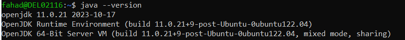
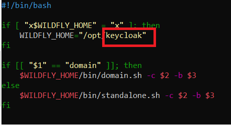
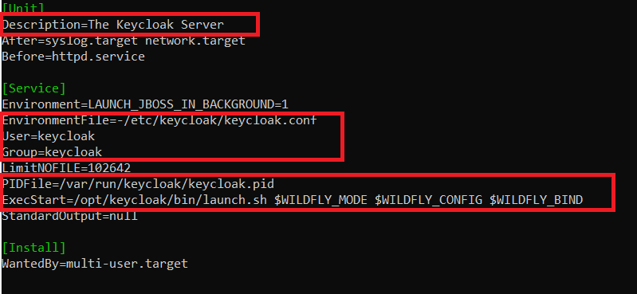
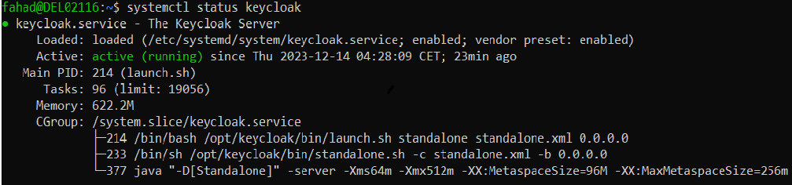
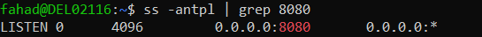
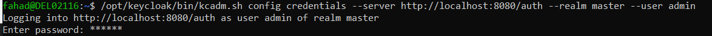
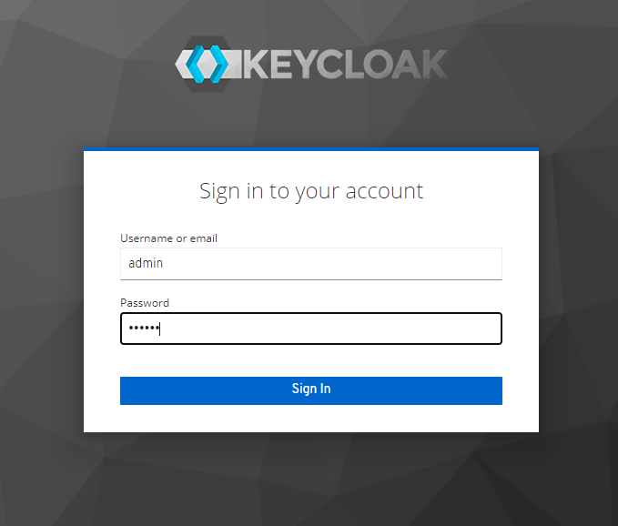

# Install KeyCloak on Ubuntu 22.04 LTS

Run the following command to update all the packages to the latest version:

```
apt-get update -y
apt-get upgrade -y
```

Keycloak is a Java based application. So we have to install Java JDK using the following command:

```
apt-get install default-jdk -y
```

Once Java is installed, you can verify the Java version using the following command:

```
java --version
```
You should see the Java version in the following output:



Next, you will need to download the latest version of Keycloak from the GitHub website.

```
wget https://github.com/keycloak/keycloak/releases/download/15.0.2/keycloak-15.0.2.tar.gz
```

After download, extract the downloaded file with the following command:

```
tar -xvzf keycloak-15.0.2.tar.gz
```

Next, move the extracted directory to the /opt with the following command:

```
mv keycloak-15.0.2 /opt/keycloak
```

Next, create a dedicated user and group for Keycloak with the following command:

```
groupadd keycloak

useradd -r -g keycloak -d /opt/keycloak -s /sbin/nologin keycloak
```

Next, set the ownership of the /opt/keycloak directory to keycloak:

```
chown -R keycloak: /opt/keycloak

chmod o+x /opt/keycloak/bin/
```
# Configure Keycloak

Next, you will need to create a Keycloak configuration directory and copy the sample configuration file. You can create it inside the /etc directory:

```
mkdir /etc/keycloak
```

Next, copy the sample configuration files from the /opt/keycloak directory using the following command:

```
cp /opt/keycloak/docs/contrib/scripts/systemd/wildfly.conf /etc/keycloak/keycloak.conf

cp /opt/keycloak/docs/contrib/scripts/systemd/launch.sh /opt/keycloak/bin/
```

Next, set proper ownership using the following command:

```
chown keycloak: /opt/keycloak/bin/launch.sh
```

Next, edit the launch.sh file and define your Keycloak path:

```
nano /opt/keycloak/bin/launch.sh
```

Change the file as shown below:




Save and close the file when you are finished.

Next, you will need to create a systemd service file to manage the Keycloak service. You can copy the sample systemd service with the following command:

```
cp /opt/keycloak/docs/contrib/scripts/systemd/wildfly.service /etc/systemd/system/keycloak.service
```

Next, edit the keycloak.service file and define the Keycloak installation path:

```
nano /etc/systemd/system/keycloak.service
```
Change the file as shown below:



Save and close the file then reload the systemd daemon to apply the changes:

```
systemctl daemon-reload
```

Next, start the Keycloak service and enable it to start at system reboot:

```
systemctl start keycloak

systemctl enable keycloak
```
You can check the status of the Keycloak service with the following command:

```
systemctl status keycloak
```

You will get the following output:



At this point, the Keycloak server is started and listens on port 8080. You can check it with the following command:

```
ss -antpl | grep 8080
```
You will get the following output:



You can also check the Keycloak server log using the following command:

```
tail -f /opt/keycloak/standalone/log/server.log
```

# Create an Admin User for Keycloak

Next, you will need to create an admin user to access the Keycloak web interface. Run the following command to create an admin user:

```
/opt/keycloak/bin/add-user-keycloak.sh -u admin
```

Set your password:

Next, restart the Keycloak service to apply the changes:

```
systemctl restart keycloak
```

Next, you will need to disable the HTTPS for Keycloak. You can disable it with the following command:

```
/opt/keycloak/bin/kcadm.sh config credentials --server http://localhost:8080/auth --realm master --user admin
```
You will be asked to provide the admin password as shown below:



Next, run the following command to disable the HTTPS:

```
/opt/keycloak/bin/kcadm.sh update realms/master -s sslRequired=NONE
```
# Access Keycloak Web Interface

Now, open your web browser and access the Keycloak web interface using the URL http://your-server-ip:8080/auth/admin. You should see the Keycloak login page:


