# ArgoCD Authentication with Keycloak

This README provides a step-by-step guide to authenticate ArgoCD with Keycloak, ensuring a secure and centralized user management system. Follow the instructions carefully to set up the authentication integration.

## Prerequisites

1. **ArgoCD** installed and running.

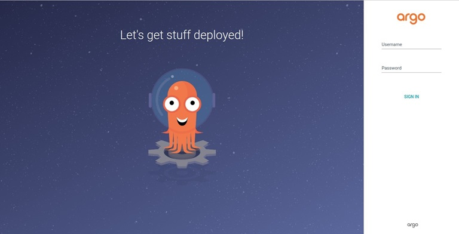

2. **Keycloak** installed and running.

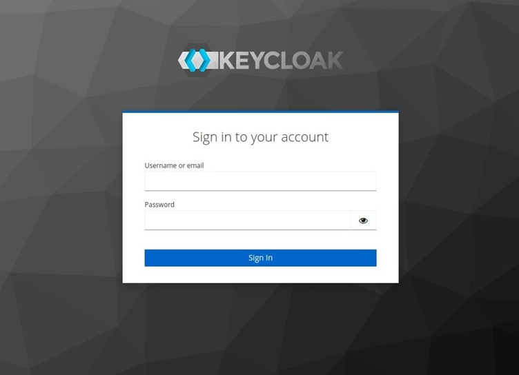

## Steps to Authenticate ArgoCD with Keycloak

### 1. Configure Keycloak


#### A. Create a Client

1. In your master realm, go to the "Clients" section.
2. Click "Create" and fill in the details:

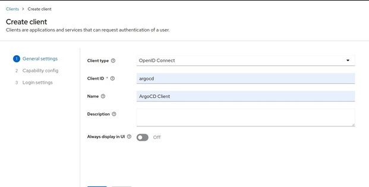

3. Click "Save".

#### B. Configure the Client

1. Enable the Client authentication.

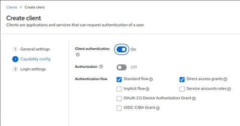

2. Configure the client by setting the Root URL, Web origins, Admin URL to the hostname (https://{hostname}).

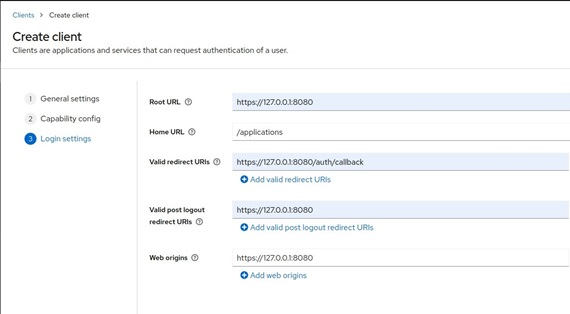

3. Click "Save".

#### C. Configure Client Credentials

1. Go to the "Credentials" tab.
2. Copy the **Secret**. This will be used in the ArgoCD configuration.

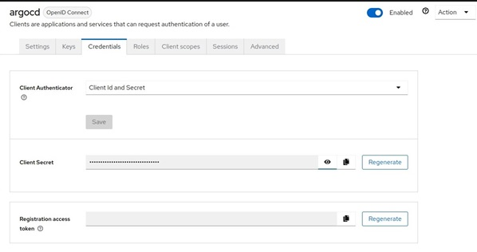

#### D. Configure Client Scope

1. Go to the "Client Scope" tab.
2. Click "Add Client Scope" and fill in the details:

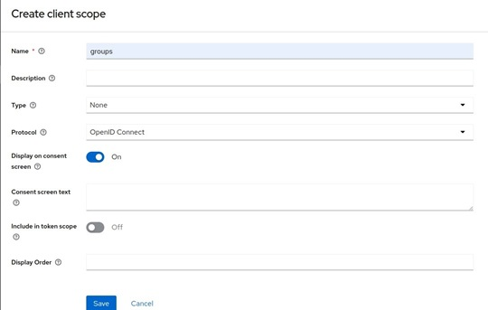

3. Click "Save".

#### E. Add Mapper

1. In the Tab "Mappers", click on "Configure a new mapper" and choose Group Membership.

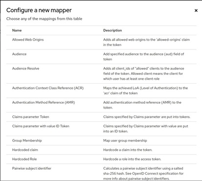

2. Make sure to set the Name as well as the Token Claim Name to groups.

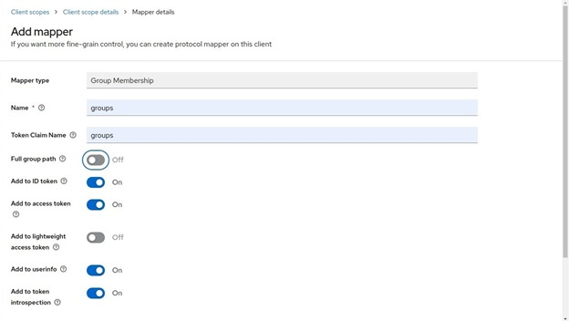

3. Click "Save".

4. Go to the Tab "Client Scopes" click on "Add client scope", choose the groups scope and add it to the "Default".

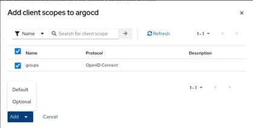

#### F. Create Group

1. Create a group called "ArgoCDAdmins".

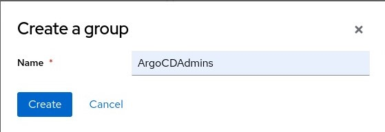


#### G. Create Users

1. Create a user and have your user join the group.

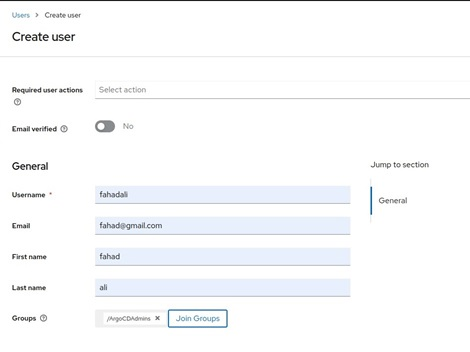

2. Create user credentials 

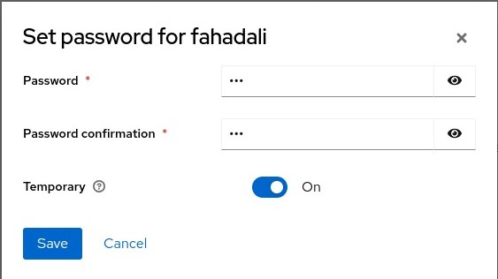

### 2. Configure ArgoCD OIDC

#### A. Encode Client Secret

1. Encode client secret in base64

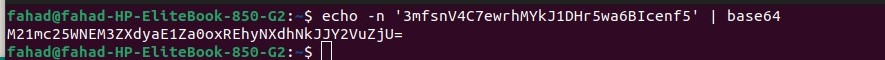

2. Then you can edit the secret and add the base64 value to a new key called oidc.keycloak.clientSecret using 

```
kubectl edit secret argocd-secret -n argocd
```

Your Secret should look something like this:

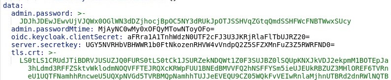

3. Now we can configure the config map and add the oidc configuration to enable our keycloak authentication. 
```
kubectl edit configmap argocd-cm -n argocd
```

Your ConfigMap should look like this:

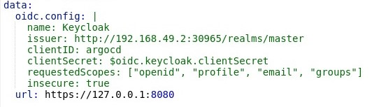

### 3. Configure ArgoCD OIDC

1. Now that we have an authentication that provides groups we want to apply a policy to these groups. We can modify the argocd-rbac-cm ConfigMap using $ kubectl edit configmap argocd-rbac-cm.


In this example we give the role role:admin to all users in the group ArgoCDAdmins.

### 4. Login

You can now login using our new Keycloak OIDC authentication using username and password we have create in keycloak:

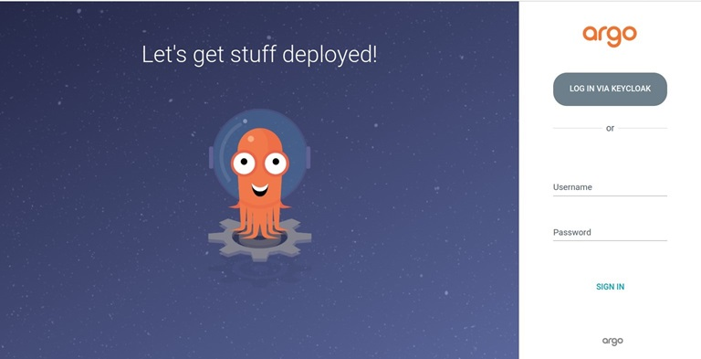

## Conclusion

By following the steps outlined in this guide, you should be able to successfully integrate Keycloak with ArgoCD for user authentication. This setup enhances security and provides centralized management for user access to ArgoCD.

For more details, refer to the official [ArgoCD documentation on Keycloak integration](https://argo-cd.readthedocs.io/en/stable/operator-manual/user-management/keycloak/).