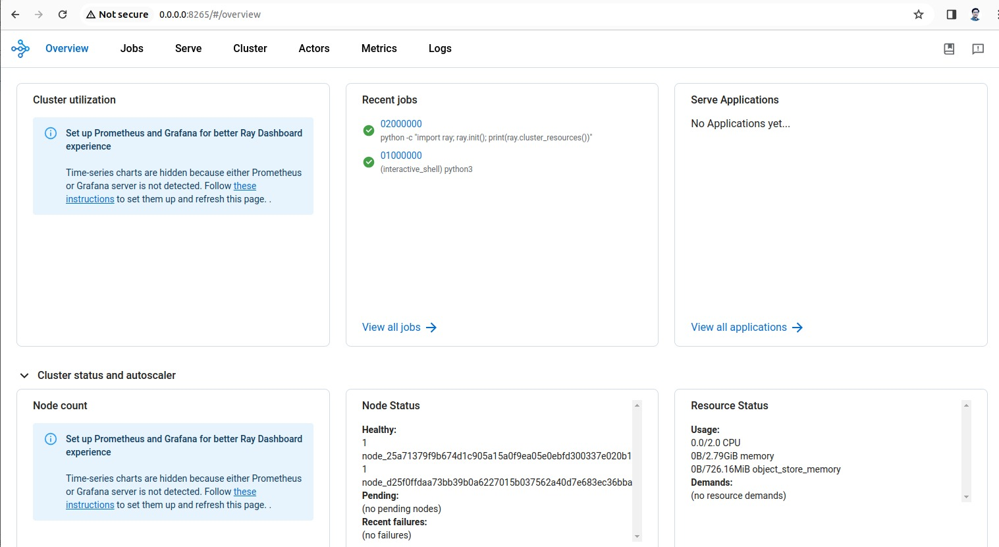

# RayCluster Installation

## Prerequisites

- Install kubectl, Helm, and Kind.
- Make sure your Kubernetes cluster has at least 4 CPU and 4 GB RAM.

## Step 1: Create a Kubernetes cluster
This step creates a local Kubernetes cluster using Kind. 

```
kind create cluster --image=kindest/node:v1.23.0
```
## Step 2: Deploy a KubeRay operator
Deploy the KubeRay operator with the Helm chart repository.

```
helm repo add kuberay https://ray-project.github.io/kuberay-helm/
helm repo update
```

Install both CRDs and KubeRay operator v1.0.0.

```
helm install kuberay-operator kuberay/kuberay-operator --version 1.0.0
```
Confirm that the operator is running in the namespace `default`.

```
kubectl get pods

# NAME                                READY   STATUS    RESTARTS   AGE
# kuberay-operator-7fbdbf8c89-pt8bk   1/1     Running   0          27s

```

# Step 3: Deploy a RayCluster custom resource
Once the KubeRay operator is running, we are ready to deploy a RayCluster. To do so, we create a RayCluster Custom Resource (CR) in the default namespace.

Deploy a sample RayCluster CR from the KubeRay Helm chart repo:
```
helm install raycluster kuberay/ray-cluster --version 1.0.0

# Once the RayCluster CR has been created, you can view it by running:
kubectl get rayclusters

# NAME                 DESIRED WORKERS   AVAILABLE WORKERS   STATUS   AGE
# raycluster-kuberay   1                 1                   ready    72s
```

The KubeRay operator will detect the RayCluster object. The operator will then start your Ray cluster by creating head and worker pods. To view Ray cluster’s pods, run the following command:
```
# View the pods in the RayCluster named "raycluster-kuberay"
kubectl get pods --selector=ray.io/cluster=raycluster-kuberay

# NAME                                          READY   STATUS    RESTARTS   AGE
# raycluster-kuberay-head-vkj4n                 1/1     Running   0          XXs
# raycluster-kuberay-worker-workergroup-xvfkr   1/1     Running   0          XXs
```

# Step 4: Run an application on a RayCluster
Now, let’s interact with the RayCluster we’ve deployed.

# Submit a Ray job to the RayCluster via ray job submission SDK
You can use the Ray job submission SDK to submit Ray jobs to the RayCluster via the Ray Dashboard port (8265 by default) where Ray listens for Job requests. The KubeRay operator configures a Kubernetes service targeting the Ray head Pod.

```
kubectl get service raycluster-kuberay-head-svc

# NAME                          TYPE        CLUSTER-IP    EXTERNAL-IP   PORT(S)                                         AGE
# raycluster-kuberay-head-svc   ClusterIP   10.96.93.74   <none>        8265/TCP,8080/TCP,8000/TCP,10001/TCP,6379/TCP   15m
```
Now that we have the name of the service, we can use port-forwarding to access the Ray Dashboard port (8265 by default).

Execute this in a separate shell.
```
kubectl port-forward --address 0.0.0.0 service/raycluster-kuberay-head-svc 8265:8265
```

Visit ${YOUR_IP}:8265 in your browser for the Dashboard (e.g. 127.0.0.1:8265)
Note: We use port-forwarding in this guide as a simple way to experiment with a RayCluster’s services. 

