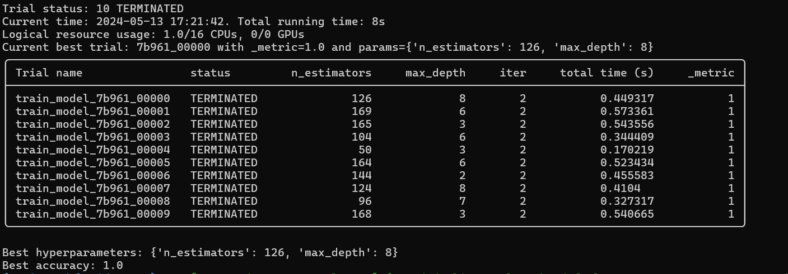

# Ray Hyperparameter Optimization Example

## Overview

This README provides an explanation of the code provided for hyperparameter optimization using Ray (Data, train and Tune), a distributed computing framework. The code performs hyperparameter tuning using Ray Tune, a component of Ray designed for scalable and distributed hyperparameter optimization.

## Code Explanation

The provided code consists of Python scripts that utilize Ray, specifically Ray Tune, for hyperparameter optimization. Below is an overview of the code structure and its components:

1. **Initialization**: The script initializes Ray and sets up the necessary environment variables for TensorBoard logging and disabling strict metric checking.

2. **Data Loading**: The script defines a function to load the Iris dataset for classification tasks.

3. **Model Training**: Another function is defined to train a Random Forest classifier on the loaded dataset. This function accepts a configuration dictionary containing hyperparameters and returns the accuracy of the trained model.

4. **Hyperparameter Search Space**: The search space for hyperparameters (number of estimators and maximum depth) is defined using Ray Tune's search space API.

5. **Hyperparameter Tuning**: Ray Tune's `tune.run()` function is used to perform hyperparameter optimization. It executes multiple trials, each with different hyperparameter configurations, and logs the results for analysis.

6. **Result Analysis**: After tuning, the script retrieves the best trial based on the specified metric (`_metric` in this case) and prints the best hyperparameters along with the corresponding accuracy.

## Solution

The solution output above indicates the best hyperparameters found during hyperparameter optimization and the corresponding accuracy achieved by the model trained with those hyperparameters. In this case, the best hyperparameters are {'n_estimators': 126, 'max_depth': 8}, and the best accuracy achieved is 1.0.

## Techniques and Outcomes

- **Techniques Used**: The code demonstrates the use of Ray Tune for hyperparameter optimization, including defining the search space, training models with different hyperparameter configurations, and analyzing results.

- **Outcome Learnings**: Through hyperparameter tuning, the code identifies the best set of hyperparameters that maximize the model's accuracy on the testing dataset. This process helps in understanding the impact of hyperparameters on model performance and improving overall model effectiveness.
