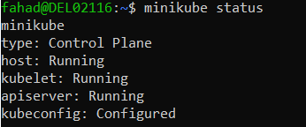
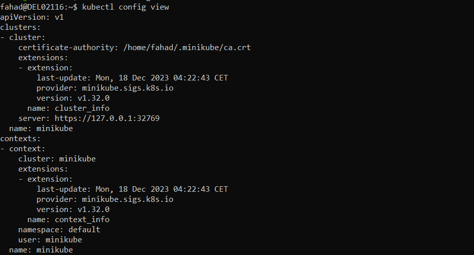
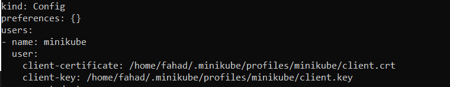
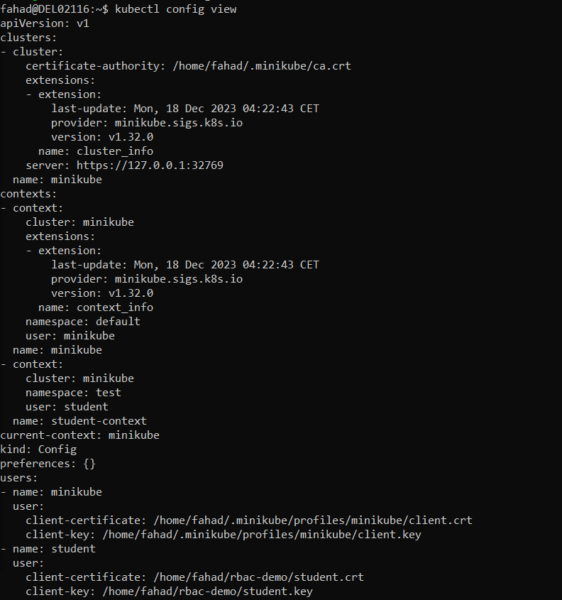

# Kubernetes Authentication and Authorization Demo

welcome to the Authentication and Authorization demo in this demoo we demonstrate the authentication and authorization steps presented on the previous page the student user on the current workstation is not configured to directly access the minikube kubernetes cluster instead the student user assumes the minicube cluster administrator role when communicating with the kubernetes api let's configure the student user and the user and grant the user a limited set of permissions through a role-based access control policy.

Before diving into the exercise make sure that the minicube kubernetes cluster is started if needed run minicube status and or minicube start to check the cluster status or start it.



Let's first view the content of the cubecontrol client configuration manifest and observe the only context **minicube** and the only user **minicube** created by default now let's create an **test** namespace for the **student** user





Now, let's create an test namespace for the student user

```
kubectl create namespace test
```

Create an rbac-demo directory and cd into it

```
mkdir rbac-demo
cd rbac-demo

```

Create a private key for the student user with open ssl tool

```
openssl genrsa -out student.key 2048
openssl req -new -key student.key -out student.csr -subj "/CN=student/0=learner"
```

Now, let's create a yaml manifest for a certificate signing request object and save it with a blank value for the request field.

```
vim signing-request.yaml
```

Content to create signing-request:

```
apiVersion: certificates.k8s.io/v1
kind: CertificateSigningRequest
metadata:
  name: student-csr
spec:
  groups:
  - system:authenticated
  request:
  usages:
  - digital signature
  - key encipherment
  - client auth
```

Now, let's view the certificate encode it in base 64 and assign it to the request field in the sign request yaml file.

```
cat student.csr | base64 | tr -d '\n'
```

Let's create the certificate signing request object then list the certificate signing request objects in the cluster

```
kubectl create -f signing-request.yaml

kubectl get csr
```

The listing shows a pending state now we need to approve the certificate signing request object then list the certificate signing request object again it will show an approved and issued state.

```
 kubectl certificate approve student.csr
```

Now. we need to extract the approved certificate from the certificate signing request decode it with base64 and save it as a certificate file then view the certificate in the newly created certificate file.

```
kubectl get csr student-csr -o jsonpath='{.status.certificate}' | base64 --decode > student.crt

cat student.crt
```

and Now, it is time to configure the cubecontrol client configuration manifest with the student user's credentials by assigning the key and certificate.

```
kubectl config set-credentials student --client-certificate=student.crt --client-key=student.key
```

Then we create a new context entry in the cubecontrol client's configuration manifest for the student user associated with the lfs 158 namespace in the minicube cluster.

```
kubectl config set-context student-context --cluster=minikube --namespace=test -user=student
```

and Now, view the content of the cubecontrol clients configuration manifestand we will observe the new context entries the student context and the new suser entry student while in the default minikube context



Let's create a new deployment in the test namespacewe are going to create a deployment by running an nginx alpine container.

```
kubectl -n test create deployment nginx --image=nginx:alpine
```

From the new context student context let's try to list pods

```
kubectl --context=student-context get pods
```

the attempt fails because the student user has no permissions configured for the student context now the following steps will assign a limited set of permissions to the student user in the student context.


First let's create a yaml configuration manifest for a pod reader role object which allows only get watch list actions in the test namespace against pod objects.

```
vim role.yaml
```

Content to create role:

```
kind: Role
metadata:
  namespace: test
  name: pod-reader
rules:
- apiGroups: [""]
  resources: ["pods"]
  verbs: ["get","watch","list"]
```

Then create the role object and list it from the default minicube context but from the test namespace.

```
kubectl create -f role.yaml
kubectl -n test get roles
```

Now, let's create a yaml configuration manifest for a role binding object which assigns the permissions of the pod reader role to the student user. 

```
vim role-binding.yaml
```

Content to create role:

```
apiVersion: rbac.authorization.k8s.io/v1
kind: RoleBinding
metadata:
  namespace: test
  name: read-pod
subjects:
- kind: User
  name: student
  apiGroup: rbac.authorization.k8s.io
roleRef:
  kind: Role
  name: pod-reader
  apiGroup: rbac.authorization.k8s.io
```

Then create the role binding object and list it from the default minicube context but from the test namespace.

```
kubectl create -f role-binding.yaml
kubectl -n test get rolebindings
```

Now, that we have assigned permissions to the student user we can successfully list the pods from the new context the student context.

```
kubectl --context=student-context get pods
```

In this demo we learn how to authenticate users with keys and certificates and how to authorize users by assigning permissions with the role and role binding objects of the rbac api group.